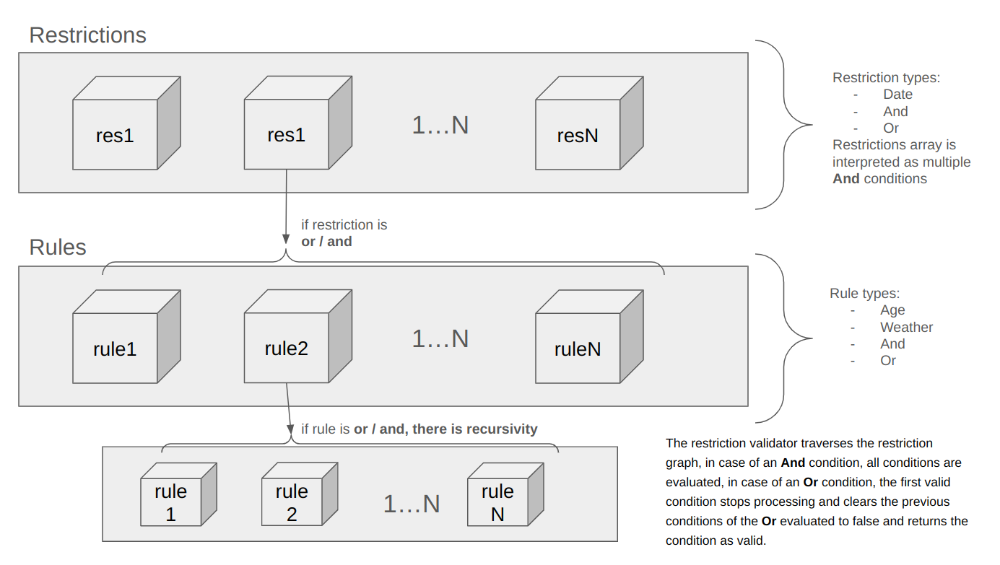

# Promocode API.

[](https://github.com/RemyRanger/promocode-module/actions/workflows/main.yaml)

## Design

- **Hexagonal Architecture**: Ensures separation of concerns by decoupling business logic from external dependencies like databases or APIs.
- **OpenAPI Integration**: Automatically generates service interfaces and client code from OpenAPI specifications, reducing boilerplate and ensuring consistency.
- **Golang Implementation**: Focused on performance, simplicity, and a strong type system.
- **Scalable Design**: Ready for production-grade enhancements such as observability, distributed tracing, and more.

## Installation

### Prerequisites

- Go (v1.24 or later)
- Docker

### Steps

1. Run database, otel-collector, grafana with docker compose:
    ```bash
    make docker_compose_up
    ```

2. Install Go modules:
    ```bash
    make install
    ```

3. Generate APIs interfaces from oas:
    ```bash
    make generate_api_interfaces
    ```

4. Run services:
    ```bash
    make run
    ```

5. Build all binaries:
    ```bash
    make build
    ```

6. Update and lint Go dependencies:
    ```bash
    make update_deps
    ```

6. Run test and see coverage in html:
    ```bash
    make test_go
    make coverage_html
    ```

7. Check telemetry from Grafana:  http://127.0.0.1:3000/grafana/dashboards

## Test with postman

Postman collection is exported in test/postman/Promocode - API.postman_collection.json

---

## Main libraries

| Name              | Description                                           |
|-------------------|-------------------------------------------------------|
| oas generator     | github.com/oapi-codegen/oapi-codegen                  |
| handler           | github.com/go-chi                                     |
| struct validator  | github.com/go-playground/validator/v10                |
| uuid generator    | github.com/google/uuid                                |
| config            | github.com/spf13/viper                                |
| db migration      | github.com/pressly/goose/v3                           |
| telemetry         | go.opentelemetry.io/otel                              |
| looger            | github.com/rs/zerolog                                 |

Test librairies : 
github.com/onsi/ginkgo/v2
github.com/onsi/gomega
github.com/testcontainers/testcontainers-go

## Design Principles

### Hexagonal Architecture

The project follows the ports and adapters pattern:

- **Ports**: Interfaces that define the behavior required by the application (e.g., repositories, external APIs).
- **Adapters**: Implementations of the ports, such as database drivers or HTTP clients.
- **Core Domain**: Business logic is isolated and does not depend on the adapters.

This ensures testability, flexibility, and the ability to swap out dependencies with minimal impact.

---

### Code Generation with OpenAPI

The OpenAPI Generator is used to:

- Create server interfaces for microservices.
- Generate strongly-typed interfaces for inter-service communication.
- Maintain consistency across services.

OAS files can be customized doc/ directory.

### Algorithme



Restrictions tree is validated in internal/services/promocode/core/restrictions_validator.go

As part of a coding exercise, I used a PostgreSQL database to store responses from the OpenWeather API. This approach was implemented to avoid exceeding the imposed API usage quota and to serve as a cache for more efficient retrieval of data. By leveraging the database, I was able to store weather data temporarily, reducing the need for redundant API calls and ensuring that the application performs better by reusing previously fetched information.

Looking ahead, there are several areas for improvement:

Decoupling of objects in the Hexagonal architecture: I aim to improve the separation of concerns between different layers of the architecture, which will make the system more modular, testable, and maintainable. By focusing on better decoupling, I can ensure that each component is independently manageable and flexible to changes in the future.

Enhancing the restriction tree management: Currently, the management of the restriction tree could benefit from more advanced validation mechanisms and the addition of new functionality. Expanding the control over restrictions will ensure the system behaves as expected even in more complex scenarios and improve the user experience.

Continuous Integration improvements: The CI pipeline will be enhanced by adding static analysis and linting jobs, ensuring code quality and style consistency across the project. Additionally, I will integrate automatic testing jobs to catch potential bugs early and guarantee a higher level of confidence in the stability of the application.

By focusing on these areas, the system will become more efficient, maintainable, and scalable.

---